# 動作環境と確認方法について
- **本アプリケーションは本番環境へのデプロイ（公開）は行っておりません。
- **ローカル環境（localhost）のみでの動作となっております。
- **アプリケーションの機能やデザインを確認いただけるよう、実際の動作画面のスクリーンショット一式を学校の提出システムに添付して提出しております。
- **お手数ですが、中身の確認はそちらの画像をご参照いただけますと幸いです。

# タイトル
- **時間共有管理アプリ

# Calendar Application (時間共有管理アプリ)
- **シンプルで使いやすいWebカレンダーアプリケーションです。
- **フロントエンド（React/Vite）とバックエンド（Spring Boot）、データベース（MySQL）を連携させた本格的なアプリです。

# 開発背景
- **私自身が計画的に行動するタイプであることから、より利便性の高いツールを目指して開発したものです。

# アプリケーションの動作画像
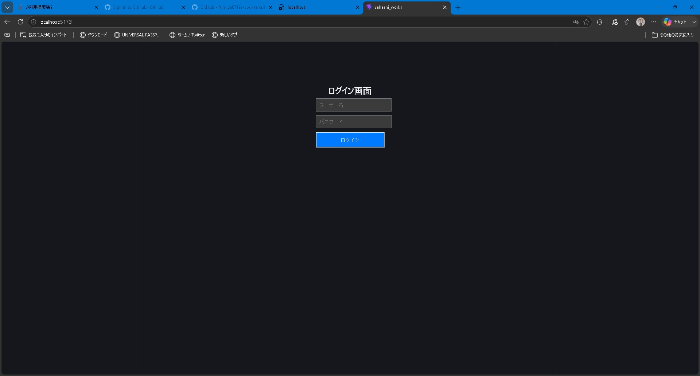
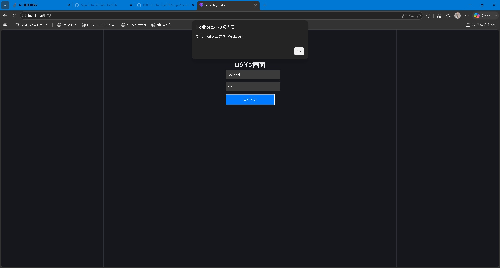
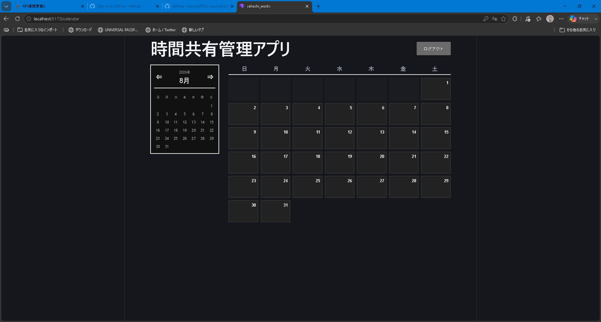
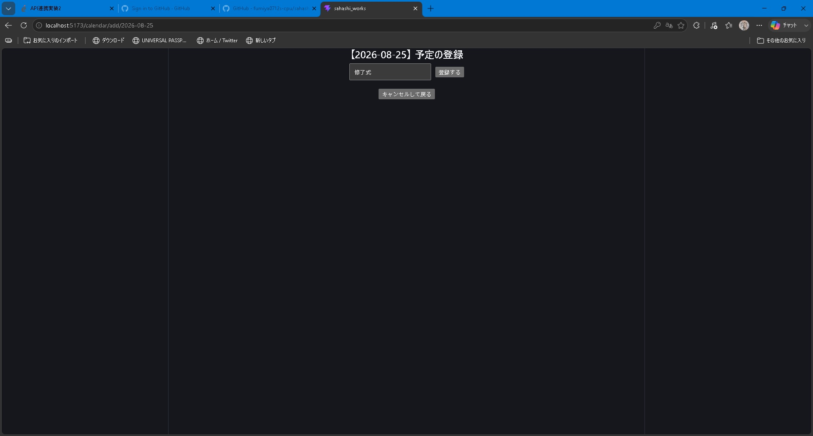
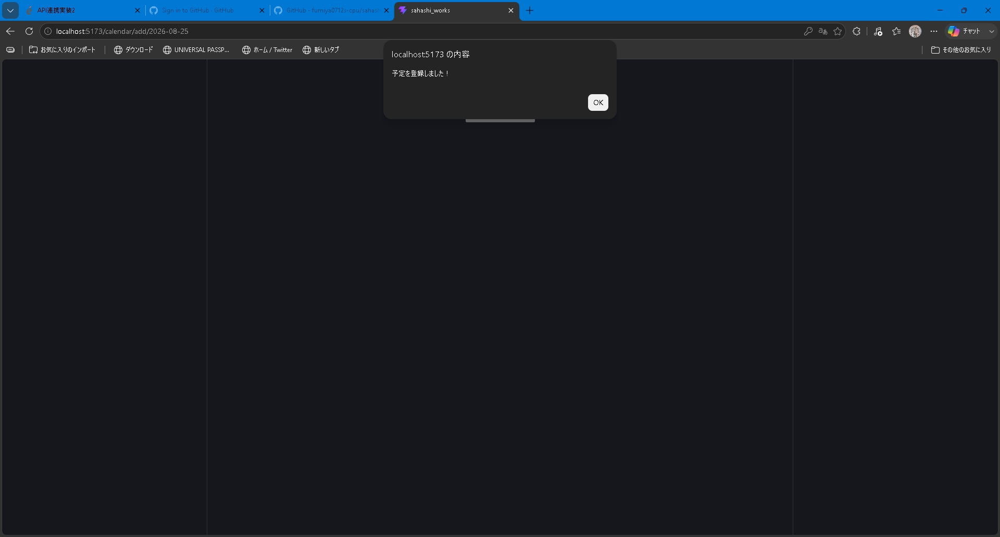
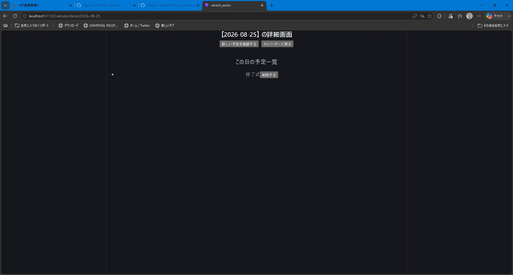
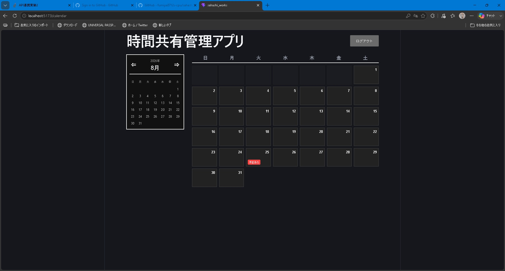
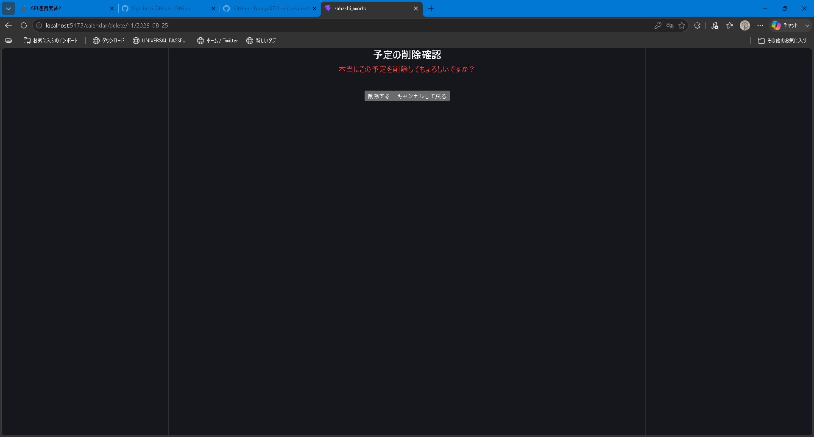
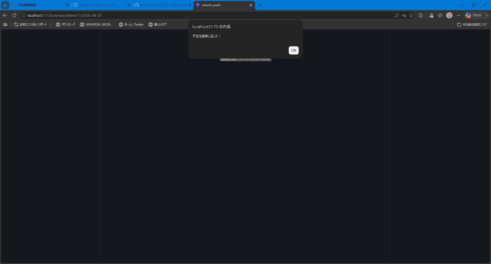
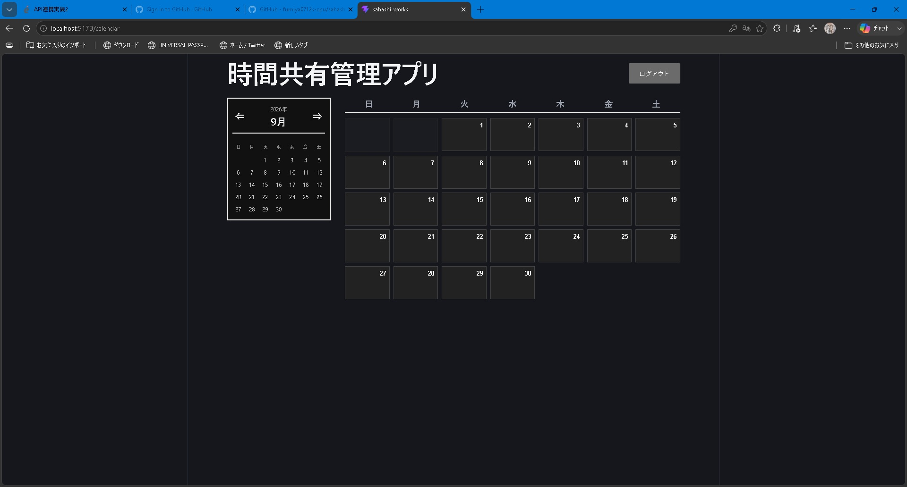
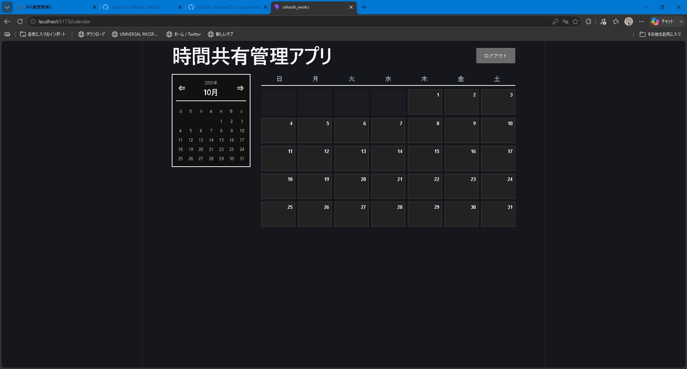

## 🚀 主な機能
- **セキュアなログイン画面: ユーザー名「sahashi」パスワード「1234」で認証
- **直感的なカレンダー表示: 日付ごのでスケジュールをグリッド一覧で確認可能
- **予定の登録機能: 日付を指定して「旅行」などのイベントを瞬時に保存
- **データベース連携: 登録した予定はMySQLに安全に永続化されます

## 🛠️ 使用している技術（技術スタック）
- **Front-end**: React 18, Vite, Axios (通信用ライブラリ)
- **Back-end**: Java 21, Spring Boot 3.2.5, Spring Data JPA
- **Database**: MySQL 8.x
- **development tool**: IntelliJ IDEA(総合開発環境)
- **Environment**: WSL2 (Ubuntu), Windows 11

## ER図
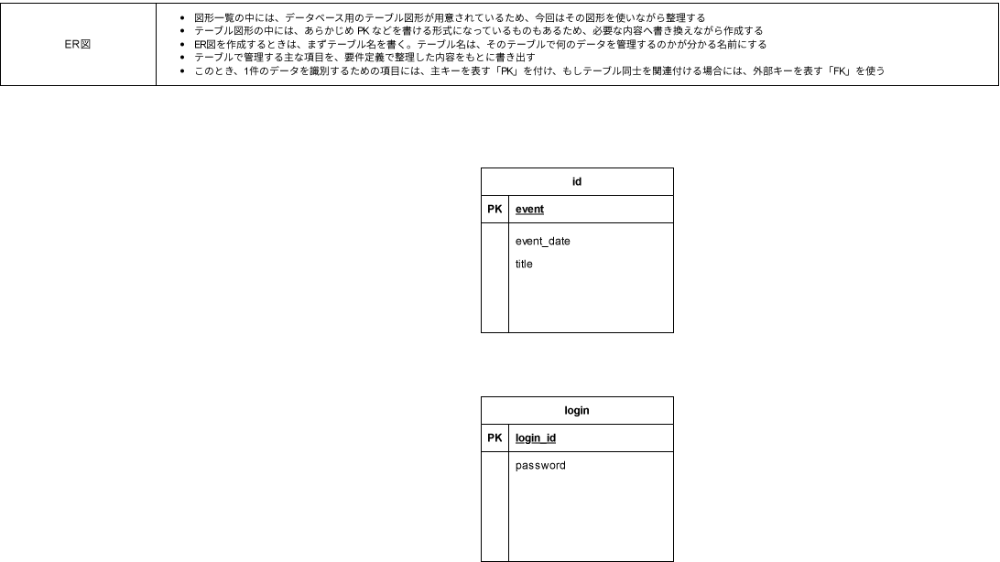

## インフラ構成図
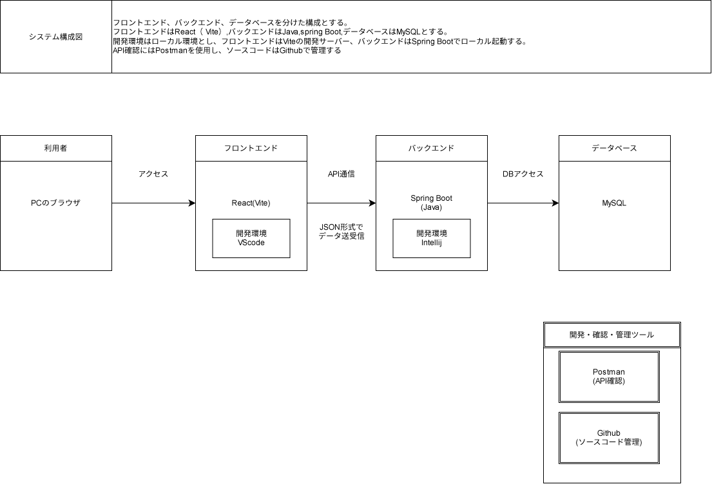

## 🏃‍♂️ 起動方法（ローカル環境）
### 1.MySQLの起動
まず最初に、裏側のデータベースサーバーを起動させる
IntelliJの一番下のターミナルのUbuntuタブを開き、以下のコマンドを実行する

```bash
sudo service mysql start
```
パスワードを求められたら`sahashi`を入力してください

### 2.バックエンド(Java)の起動
データベースが起動後、画面右上の「緑色の再生ボタン(▶)」をクリックするか、Intellijの「ローカル」タブで以下を実行してバックエンドを立ち上げます。

```bash
cd sahashi_backend
.\mvnw.cmd spring-boot:run
```

※起動後、自動的に http://localhost:8080/events でAPIが待機します。

### 3.フロントエンド (React) の起動
最後に、画面右上の「緑色の再生ボタン(▶)」をクリックするか、ターミナルで以下を実行して画面を立ち上げます。

```bash
cd sahashi_works
npm run dev
```

※起動後、ブラウザで http://localhost:5173/ にアクセスするとアプリが使用できます。

## 🔑 デモ用ログイン情報
- **ユーザー名**:`sahashi`
- **パスワード**:`1234`